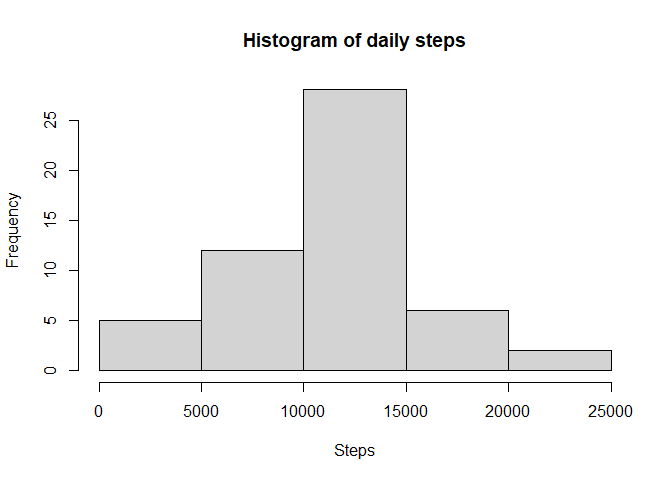
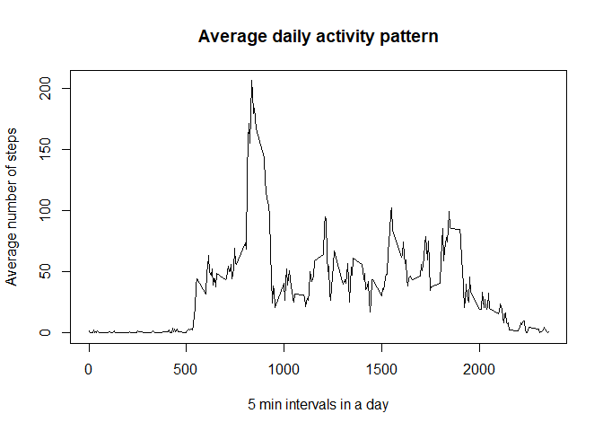
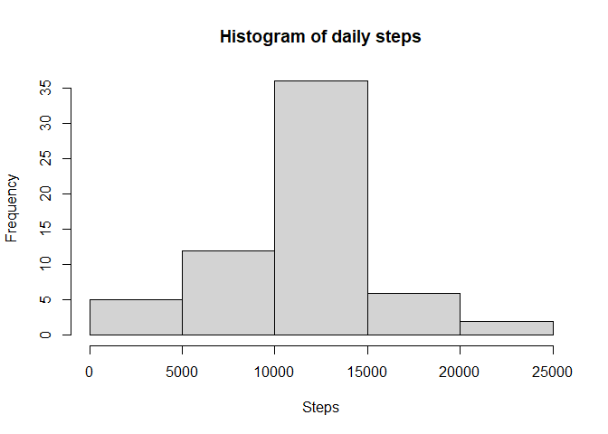
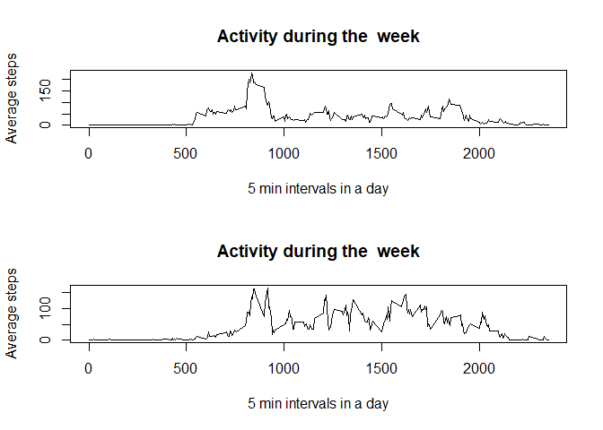

## Loading and preprocessing the data


```r
unzip("activity.zip")
activity<-read.csv("~/Coursera/RepData_PeerAssessment1/activity.csv")
```


## What is mean total number of steps taken per day?


```r
stepsperday<-aggregate(steps~date,activity,sum)
hist(stepsperday$steps, xlab="Steps", main="Histogram of daily steps")
```

<!-- -->


```r
meansteps<-mean(stepsperday$steps)
mediansteps<-median(stepsperday$steps)

summaryofsteps<-as.data.frame(meansteps,col.names=c("mean"))
summaryofsteps$median<-mediansteps
print(summaryofsteps)
```

```
##   meansteps median
## 1  10766.19  10765
```

## What is the average daily activity pattern?


```r
averagedailysteps<- aggregate(steps~interval,activity, mean)

plot(steps~interval,data=averagedailysteps, type = "l", 
     xlab = "5 min intervals in a day", 
     ylab = "Average number of steps", 
     main = "Average daily activity pattern")
```

<!-- -->


```r
averagedailysteps[which.max(averagedailysteps[, 2]), 1]
```

```
## [1] 835
```


## Imputing missing values

#Calculate the number of missing values


```r
sum(is.na(activity$steps)) 
```

```
## [1] 2304
```
#Filling in missing values with the average steps


```r
newdata<- activity
len1<- nrow(newdata)
len2<-nrow(averagedailysteps)
for (i in 1:len1) {
  if (is.na(newdata$steps[i])) {
    for (j in 1:len2) {
      if (newdata$interval[i] == averagedailysteps[j, 1]) {
        newdata$steps[i] = averagedailysteps[j, 2]
      }
    } 
  }    
}
summary(newdata)
```

```
##      steps            date              interval     
##  Min.   :  0.00   Length:17568       Min.   :   0.0  
##  1st Qu.:  0.00   Class :character   1st Qu.: 588.8  
##  Median :  0.00   Mode  :character   Median :1177.5  
##  Mean   : 37.38                      Mean   :1177.5  
##  3rd Qu.: 27.00                      3rd Qu.:1766.2  
##  Max.   :806.00                      Max.   :2355.0
```
#Mean and median with calculated missing values


```r
newstepsperday<-aggregate(steps~date,newdata,sum)
hist(newstepsperday$steps, xlab="Steps", main="Histogram of daily steps")
```

<!-- -->


```r
newmeansteps<-mean(newstepsperday$steps)
newmediansteps<-median(newstepsperday$steps)

newsummaryofsteps<-as.data.frame(newmeansteps,col.names=c("mean"))
newsummaryofsteps$median<-newmediansteps
print(newsummaryofsteps)
```

```
##   newmeansteps   median
## 1     10766.19 10766.19
```

From the histogram and the mean and median value we see that there is no significant impact of the imputing of missing values.

## Are there differences in activity patterns between weekdays and weekends?


```r
library(dplyr)
```

```
## 
## Attaching package: 'dplyr'
```

```
## The following objects are masked from 'package:stats':
## 
##     filter, lag
```

```
## The following objects are masked from 'package:base':
## 
##     intersect, setdiff, setequal, union
```

```r
newdata$weekday<-format ( as.POSIXct ( newdata$date),      "%A" )
newdata<-newdata %>% mutate("Day"=case_when(
   weekday=="Monday" ~ "weekday",
   weekday=="Tuesday" ~"weekday",
   weekday=="Wednesday" ~ "weekday",
   weekday=="Thursday" ~ "weekday",
   weekday=="Friday" ~ "weekday",
   weekday=="Saturday" ~ "weekend",
   weekday=="Sunday" ~ "weekend"))

newaveragedailysteps<- aggregate(steps~interval+Day,data=newdata, mean)

par(mfrow=c(2,1))

plot(steps~interval,data=filter(newaveragedailysteps,Day=="weekday"), type = "l",xlab = "5 min intervals in a day",ylab = "Average steps",main = "Activity during the  week")

plot(steps~interval,data=filter(newaveragedailysteps,Day=="weekend"), type = "l",xlab = "5 min intervals in a day",ylab = "Average steps",main = "Activity during the  week")
```

<!-- -->

